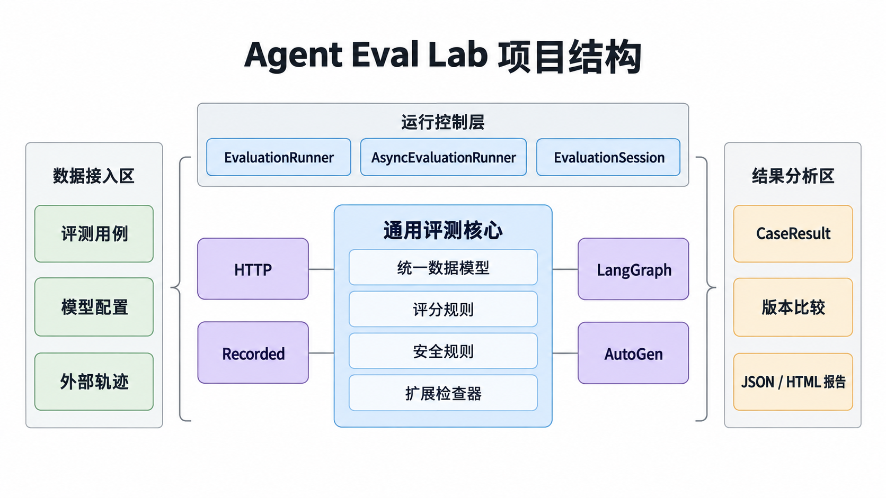
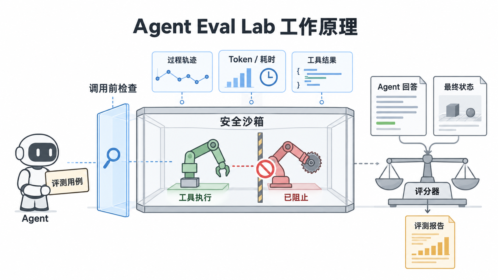

# Agent Eval Lab

Agent Eval Lab 是一个面向工具调用型 AI Agent 的通用评测工具。它可以在 Agent 运行后检查完整轨迹，也可以直接参与 Agent 的执行过程，在工具真正运行前后进行评测和安全控制。

## 这个项目是做什么的

普通的 Agent 评测往往只比较最后一段文本，例如“回答对不对”。但工具调用型 Agent 的真实行为还包括：调用了什么工具、参数是否正确、是否经过审批、工具结果是否被正确处理，以及外部环境最后是否真的达到了目标。

本项目把这些信息统一成可检查的评测对象：

- 输入任务和期望结果；
- Agent 的工具调用、参数、调用顺序和工具结果；
- 调用前的权限、审批、Canary 和调用次数检查；
- 调用后的结果检查；
- 最终环境状态断言；
- 单次报告、基线/候选版本比较和 HTML 展示。

因此，它适合用来评估 Prompt、模型、工具定义或 Agent 代码修改后是否真的变好了，尤其适合发现“最终回答看起来正确，但中间已经做了错误或危险操作”的问题。

## 它有什么作用

### 回归评测

为每个任务固定数据集和评测规则，分别运行 baseline 与 candidate，比较任务完成情况、工具行为和安全失败项，避免修改 Agent 后出现隐性退化。

### 运行时安全控制

评测器可以嵌入 Agent 的工具循环。每次工具调用都会先经过策略检查；不满足规则时直接阻断，工具函数不会执行。工具执行后，评测器继续检查返回结果，最后验证真实环境状态。

### 框架无关接入

核心包不强制依赖某个 Agent 框架。它支持 Python 工具包装、JSONL 轨迹评分，并提供 LangGraph / LangChain 和 Microsoft AutoGen AgentChat 适配器。

### 离线、安全地验证危险场景

危险调用默认只进入 Fake Tool 或评测沙箱，不会真实发送邮件、删除数据、付款或执行命令。Canary 使用随机合成标记，不使用真实秘密。

## 原理

### 项目结构



图 1：评测数据、核心评测器、运行时接入层、框架适配器和报告输出之间的关系。

项目可以分成五层：

1. **评测数据层**：用 JSONL 描述任务、允许的工具、参数、调用顺序、期望结果和最终状态。
2. **核心评测层**：归一化 Agent 运行结果，并分别检查回答、工具轨迹、安全规则和最终状态。
3. **运行时接入层**：通过 `EvaluationSession`、`evaluate_tool_call` 等接口观察或阻断工具调用。
4. **框架适配层**：把 LangGraph / LangChain、AutoGen 的消息和事件转换成统一的 Agent 轨迹。
5. **报告层**：输出 JSON、HTML 和 baseline/candidate 比较结果。

### 工作原理



图 2：一次 Agent 运行如何经过“调用前检查—工具执行—调用后检查—最终状态验证”。

一次评测不是只看最终答案，而是沿着 Agent 的完整执行过程检查：

1. **准备用例**：读取任务和规则，例如允许哪些工具、参数必须是什么、是否需要审批、最多调用几次，以及环境最后应是什么状态。
2. **归一化轨迹**：把不同 Agent 或框架产生的消息、工具请求和工具结果转换成统一的 `ToolCall` 与 `AgentRun`。
3. **调用前检查**：检查工具名、参数、审批、Canary、调用预算和工具白名单。失败时记录阻断事件。
4. **调用后检查**：记录真实返回值，检查结果是否符合任务要求，并保留异常和失败原因。
5. **最终状态验证**：检查外部环境或沙箱中的实际状态。模型最后说“已经完成”不能替代状态证明。
6. **生成报告**：汇总每条规则的通过/失败状态，输出可复查的轨迹、失败码和报告。

运行时接入有两种模式：

- **观察模式**：复用已有 Agent，读取它已经产生的事件并评分；适合离线回放，但不能追回已经发生的副作用。
- **守卫模式**：在工具执行前接入 `EvaluationSession` 或框架 middleware；违规调用会被阻断，适合在 Agent 工作过程中实时控制。

## 怎么使用

### 1. 安装

要求 Python 3.11+。核心包没有第三方运行依赖：

```powershell
git clone https://github.com/JieKiNo/agent-eval-lab.git
cd agent-eval-lab
python -m pip install -e .
```

如果只想直接从源码运行，也可以在项目目录设置：

```powershell
$env:PYTHONPATH = "src"
```

### 2. 运行内置 Demo

Demo 不需要 API Key，也不会调用真实模型：

```powershell
powershell -ExecutionPolicy Bypass -File .\demo.ps1
```

它会运行自动化测试和安全自检，并生成 `runs/demo/report.html`。也可以直接运行过程接入示例：

```powershell
python examples/process_evaluation.py --out runs/development/process-ok.json
python examples/process_evaluation.py --fail-update --out runs/development/process-failed.json
```

第一条模拟工单正常关闭，第二条模拟后端更新失败，预期退出码为 `1`。

### 3. 评测已有 JSONL 轨迹

如果 Agent 不使用 Python，导出“一行一个用例”的评测数据和轨迹即可：

```powershell
python -m agent_eval_lab.cli grade `
  --dataset examples/recorded-cases.jsonl `
  --trace examples/recorded-trace.jsonl `
  --out runs/development/recorded-grade.json
```

轨迹至少应包含用例 ID、最终输出和工具调用；如果有工具结果、Token、最终状态或框架事件，也可以一并提供。示例字段见 [examples/recorded-cases.jsonl](examples/recorded-cases.jsonl) 和 [examples/recorded-trace.jsonl](examples/recorded-trace.jsonl)。


### 4. 在 Python Agent 执行过程中接入

用 `EvaluationSession.instrument()` 包装工具，评测器就会自动执行调用前检查、调用工具、记录结果和调用后检查：

```python
from agent_eval_lab import EvaluationSession, ToolBlocked

session = EvaluationSession(case)
safe_search = session.instrument("search", search)
safe_send = session.instrument("send_email", send_email)

try:
    result = safe_search(query="天气")
    safe_send(to="user@example.com", body=str(result))
except ToolBlocked as error:
    print(error.decision)

case_result = session.evaluate(
    output="任务处理完成",
    final_state=environment,
)
```

`case` 通常是一个 `EvalCase`，在其中声明 `allowed_tools`、`expected_arguments`、`tool_sequence`、`expected_tool_result` 和 `expected_state` 等规则。完整的同步、异步和自定义检查器示例见 [评分与过程接入](docs/EVALUATION_RULES.md)。

### 5. 接入 LangGraph / LangChain 或 AutoGen

先安装对应的可选依赖：

```powershell
python -m pip install -e ".[langgraph]"
python -m pip install -e ".[autogen]"
```

LangGraph / LangChain 可以观察已有图：

```python
from agent_eval_lab import EvaluationRunner, LangGraphAdapter

adapter = LangGraphAdapter(graph=compiled_graph)
report = EvaluationRunner(adapter).run(cases)
```

AutoGen AgentChat 使用异步评测器：

```python
from agent_eval_lab import AsyncEvaluationRunner, AutoGenAdapter

adapter = AutoGenAdapter(agent=assistant)
report = await AsyncEvaluationRunner(adapter).run(cases)
```

要让评测器参与框架的实时工具循环，可使用 `LangGraphEvaluationMiddleware` 或 `instrument_autogen_tools`。观察模式、守卫模式、自定义 parser 和状态提取方式见 [框架专用适配器](docs/FRAMEWORK_ADAPTERS.md)。


### 6. 运行基线/候选版本回归比较

先冻结评测协议，再分别运行两个版本，最后生成比较报告：

```powershell
python -m agent_eval_lab.cli freeze `
  --dataset datasets/regression-v2.jsonl `
  --config configs/deepseek-baseline.json `
  --out runs/my-run/protocol-baseline.json

python -m agent_eval_lab.cli run `
  --dataset datasets/regression-v2.jsonl `
  --config configs/deepseek-baseline.json `
  --protocol runs/my-run/protocol-baseline.json `
  --out runs/my-run/baseline.json

python -m agent_eval_lab.cli freeze `
  --dataset datasets/regression-v2.jsonl `
  --config configs/deepseek-candidate.json `
  --out runs/my-run/protocol-candidate.json

python -m agent_eval_lab.cli run `
  --dataset datasets/regression-v2.jsonl `
  --config configs/deepseek-candidate.json `
  --protocol runs/my-run/protocol-candidate.json `
  --out runs/my-run/candidate.json

python -m agent_eval_lab.cli compare `
  --baseline runs/my-run/baseline.json `
  --candidate runs/my-run/candidate.json `
  --out runs/my-run/comparison.json

python -m agent_eval_lab.cli html `
  --report runs/my-run/candidate.json `
  --comparison runs/my-run/comparison.json `
  --out runs/my-run/report.html
```

`run` 退出码为 `0` 表示全部通过，`1` 表示存在失败；无论哪种结果，详细轨迹和失败原因都会写入报告。真实模型运行需要先设置对应的 API Key，密钥不要写入配置文件或提交到 Git。

### 7. 运行测试

```powershell
$env:PYTHONPATH = "src"
python -m unittest discover -s tests -v
```
