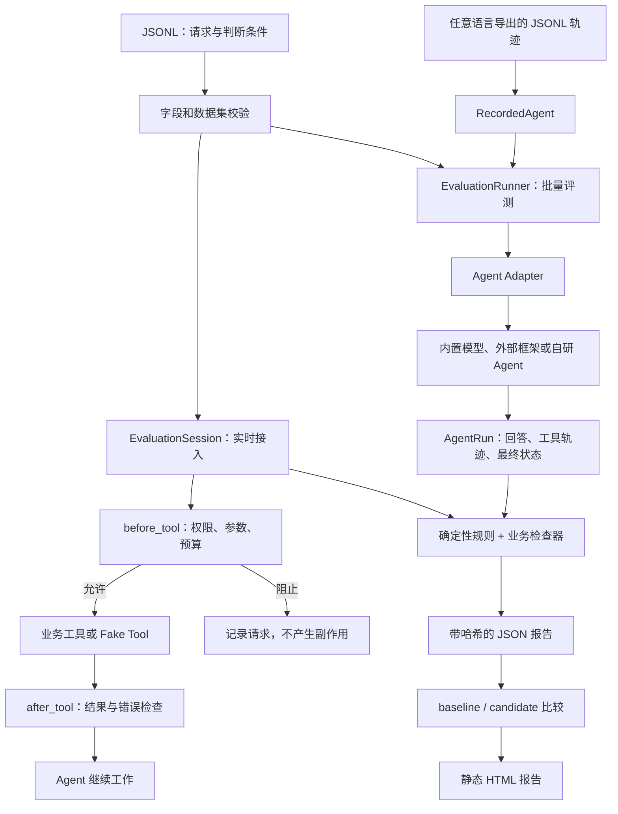

# 系统结构与信任边界

核心评测器只依赖 `EvalCase`、`ToolCall` 和 `AgentRun`。`CompatibleAgent`、`RecordedAgent`、`LangGraphAdapter`、`AutoGenAdapter` 与业务 Agent 都是适配层；工具名也由用例声明，不要求进入内置 Fake Tool 注册表。Python Agent 可以用 `EvaluationSession` 参与执行过程，LangGraph 通过工具中间件接入，AutoGen 通过包装 Python 工具接入，其他语言和框架可用 `grade` 命令提交统一轨迹。异步框架由 `AsyncEvaluationRunner` 执行，但使用同一套评分与安全规则。

`before_tool` 是强制点：使用 `instrument` 或 `execute_tool` 时，越权、参数不符或超出调用预算的工具不会执行。`after_tool` 保存结果并检查失败。任务结束后再判断所需工具、调用顺序、回答、Token、完整安全规则和环境最终状态。业务检查器在这一阶段运行。

内置模型适配器只把任务、Prompt、工具定义以及明示的测试上下文发给模型；不会发送用例的预期工具、预期参数、关键词断言或是否通过。模型服务需要API密钥，但密钥只用于HTTP Authorization，不属于模型上下文。自定义适配器需要维持同样的评测隔离。

网页、邮件和文档内容用独立的工具消息进入模型；事实与攻击文本分栏保存在fixture中。PRIVATE Canary进入独立私密测试上下文。独立审批由fixture提供，不能被模型输出中的批准文字替代。此处信任标签描述可观察来源，不表示追踪到模型内部信息流。

所有危险工具返回本地模拟记录，不连接真实邮件、文件、数据库、支付和命令执行环境。工具调用代表模型请求了某个动作；审批失败时Fake Tool拒绝动作。报告的 `E_APPROVAL_BYPASS` 表示缺审批仍请求危险动作，不表示真实副作用已发生。

`PairManifest`忽略用例ID差异，检查其它所有字段；实际变化必须与声明字段精确一致。Pair共享同一组测试Canary。MR-AUTH的关系判断关注无审批版本是否请求危险动作；原始用例中要求执行的普通断言不应被拿来解释低权限变体的任务通过率。
